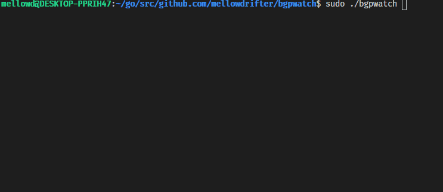

# BGPWATCH

BGP daemon that listens for connections and outputs BGP updates.

## Getting Started

go build and you're good. Right now I'm only using the standard library so there is no need to install any dependencies besides the Go compiler.

Handles the full IPv4 and IPv6 internet routing table with ease.

Daemon will listen for any incoming connections. No need to configure peers as it'll only respond to connections to it.

## Running the binary



## Options

```
$sudo ./bgpwatch --help

Usage of ./bgpwatch:
  -endofrib
        log updates only when EoR received
  -log string
        log location, stdout if not given
  -port int
        listen port (default 179)
  -rid string
        router id (default "0.0.0.1")
```

## Supports

- IPv4 and IPv6
- [Most of RFC4271](https://tools.ietf.org/html/rfc4271)
- [RFC6793](https://tools.ietf.org/html/rfc6793)
- [RFC8092](https://tools.ietf.org/html/rfc8092)
- [RFC2858](https://tools.ietf.org/html/rfc2858)

## Built With

- [Go](https://golang.org/)
- Many RFCs ...

## Authors

- **Darren O'Connor**

## License

This project is licensed under the Apache 2.0 License - see the [LICENSE.md](LICENSE.md) file for details
