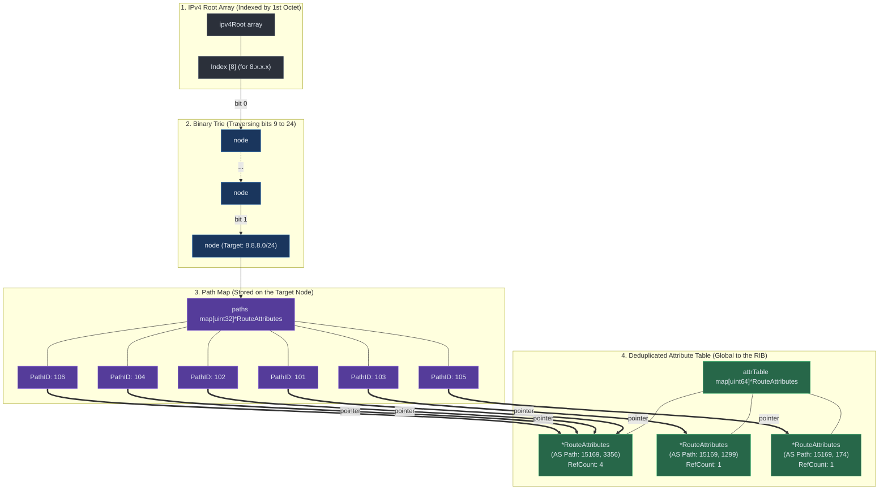

# BGPWATCH

A highly concurrent, memory-optimized BGP daemon that listens for BGP connections, ingests full Internet routing tables, and exposes deep visibility and analytics via a gRPC/HTTP API.

## Features

- **Passive Collector**: Listens for any incoming BGP connections and acts as a passive analytics sink (never readvertises routes).
- **Multi-Path / Add-Path Support**: Natively supports ingesting and storing multiple paths for the exact same prefix via BGP Add-Path.
- **Memory Optimized RIB**: Implements a highly memory-efficient Radix Trie with globally deduplicated Route Attributes (AS Paths, Communities, LocalPref).
- **Security**: Supports TCP MD5 authentication for securing peer sessions.
- **Observability API**: Provides a gRPC and HTTP (`/stats`) API to query exact paths, masks, routing distributions, and regex-based AS Path searches across multiple peers.

## Supported RFCs

BGPWatch natively implements the following specifications:
- [RFC 4271](https://tools.ietf.org/html/rfc4271) - A Border Gateway Protocol 4 (BGP-4)
- [RFC 2858](https://tools.ietf.org/html/rfc2858) - Multiprotocol Extensions for BGP-4 (IPv4/IPv6)
- [RFC 4456](https://tools.ietf.org/html/rfc4456) - BGP Route Reflection (Client capability)
- [RFC 6793](https://tools.ietf.org/html/rfc6793) - BGP Support for Four-Octet AS Number Space
- [RFC 1997](https://tools.ietf.org/html/rfc1997) - BGP Communities Attribute
- [RFC 8092](https://tools.ietf.org/html/rfc8092) - BGP Large Communities Attribute
- [RFC 2385](https://tools.ietf.org/html/rfc2385) - Protection of BGP Sessions via the TCP MD5 Signature Option
- [RFC 7911](https://tools.ietf.org/html/rfc7911) - Advertisement of Multiple Paths in BGP (Add-Path)

## Getting Started

Building the project requires only the standard Go compiler with no external dependencies.
```bash
go build -o bgpwatch .
```

## Options

```bash
$ sudo ./bgpwatch --help

Usage of ./bgpwatch:
  -asn uint
        my autonomous system number (default 64533)
  -config string
        path to JSON configuration file containing peer IPs and MD5 passwords
  -endofrib
        log updates only when EoR received
  -gogc int
        set the garbage collection target percentage (default 100)
  -grpc int
        gRPC listen port (default 1179)
  -ignore-communities
        ignore and discard BGP communities and large communities
  -log string
        log location, stdout if not given
  -port int
        listen port (default 179)
  -quiet
        suppress per-update logging, show only periodic stats
  -rid string
        router id (default "0.0.0.1")
```

## Memory Optimized Routing Table

BGPWatch utilizes a highly memory-optimized Radix Trie combined with a Deduplicated Attribute Table. If a remote peer sends multiple paths (Add-Path) for the same prefix, the daemon deduplicates the structural information, saving significant memory.

Here is how 6 different paths for the same prefix (e.g. `8.8.8.0/24`) are stored efficiently in the peer's RIB in RAM:


```mermaid
graph TD
    classDef array fill:#2b303a,stroke:#4a5568,color:#e2e8f0
    classDef node fill:#1a365d,stroke:#2b6cb0,color:#e2e8f0
    classDef map fill:#553c9a,stroke:#805ad5,color:#e2e8f0
    classDef attr fill:#276749,stroke:#48bb78,color:#e2e8f0
    
    subgraph "1. IPv4 Root Array (Indexed by 1st Octet)"
        Root[ipv4Root array]:::array
        Idx["Index [8] (for 8.x.x.x)"]:::array
        Root --- Idx
    end

    subgraph "2. Binary Trie (Traversing bits 9 to 24)"
        Node1[node]:::node
        Node2[node]:::node
        Node3["node (Target: 8.8.8.0/24)"]:::node
        
        Idx -->|bit 0| Node1
        Node1 -.->|...| Node2
        Node2 -->|bit 1| Node3
    end

    subgraph "3. Path Map (Stored on the Target Node)"
        PathsMap["paths map[uint32]*RouteAttributes"]:::map
        
        Path1["PathID: 101"]:::map
        Path2["PathID: 102"]:::map
        Path3["PathID: 103"]:::map
        Path4["PathID: 104"]:::map
        Path5["PathID: 105"]:::map
        Path6["PathID: 106"]:::map
        
        Node3 --> PathsMap
        PathsMap --- Path1
        PathsMap --- Path2
        PathsMap --- Path3
        PathsMap --- Path4
        PathsMap --- Path5
        PathsMap --- Path6
    end

    subgraph "4. Deduplicated Attribute Table (Global to the RIB)"
        AttrTable["attrTable map[uint64]*RouteAttributes"]:::attr
        
        AttrA["*RouteAttributes<br/>(AS Path: 15169, 3356)<br/>RefCount: 4"]:::attr
        AttrB["*RouteAttributes<br/>(AS Path: 15169, 1299)<br/>RefCount: 1"]:::attr
        AttrC["*RouteAttributes<br/>(AS Path: 15169, 174)<br/>RefCount: 1"]:::attr
        
        AttrTable --- AttrA
        AttrTable --- AttrB
        AttrTable --- AttrC
    end

    %% Pointers from Path Map to Deduplicated Attributes
    Path1 ==>|pointer| AttrA
    Path2 ==>|pointer| AttrA
    Path3 ==>|pointer| AttrB
    Path4 ==>|pointer| AttrA
    Path5 ==>|pointer| AttrC
    Path6 ==>|pointer| AttrA
```

## Built With

- [Go](https://golang.org/)

## Authors

- **Darren O'Connor**

## License

This project is licensed under the Apache 2.0 License - see the [LICENSE](LICENSE) file for details
